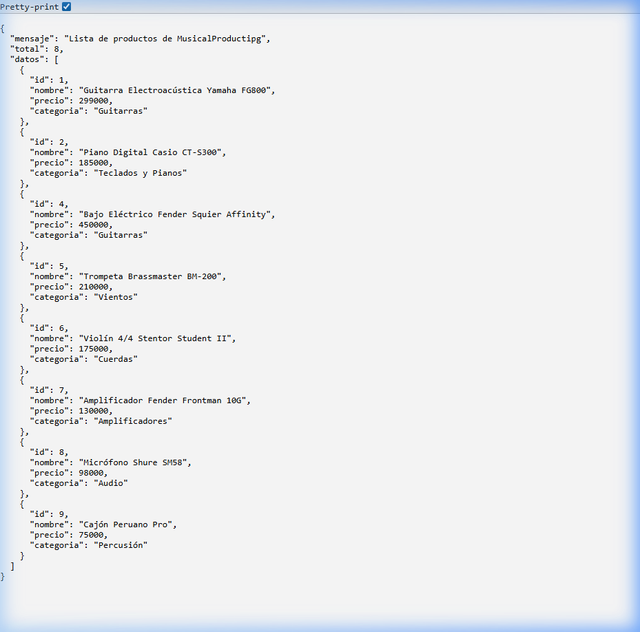
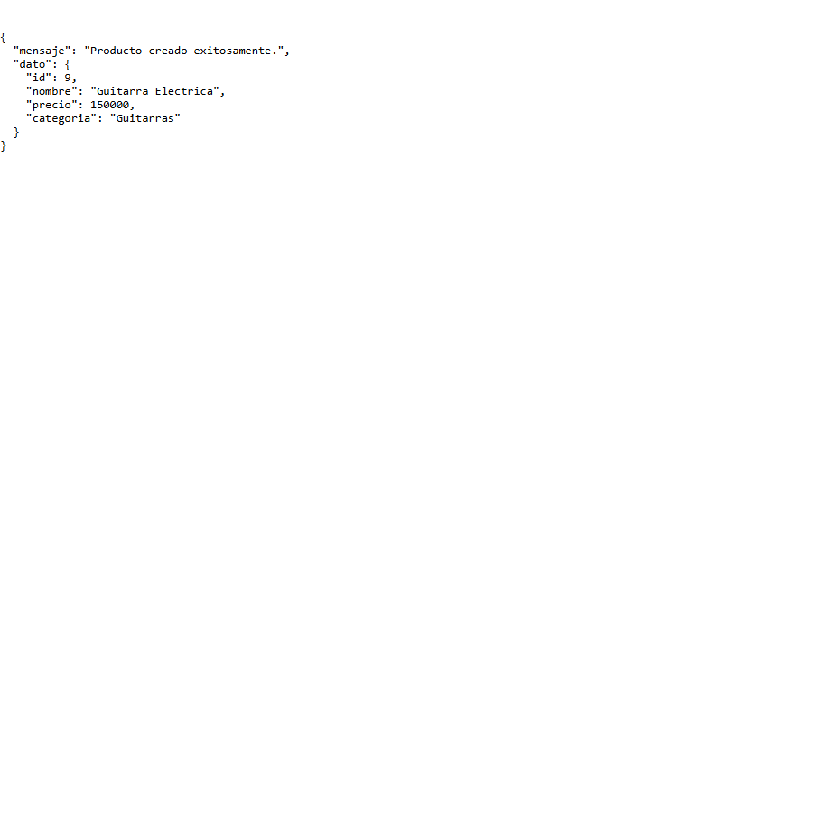
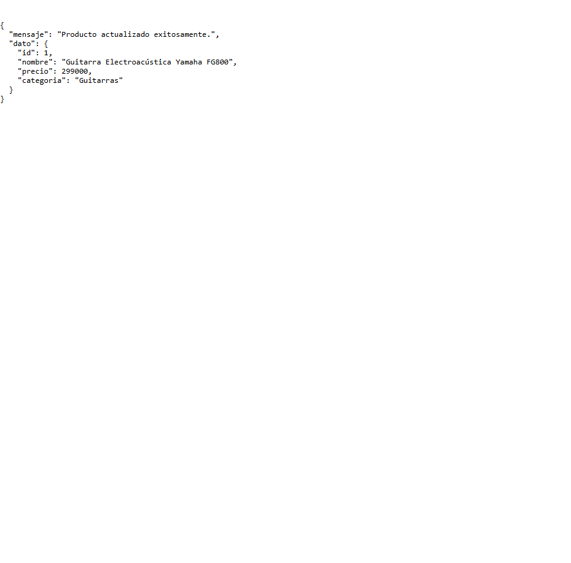
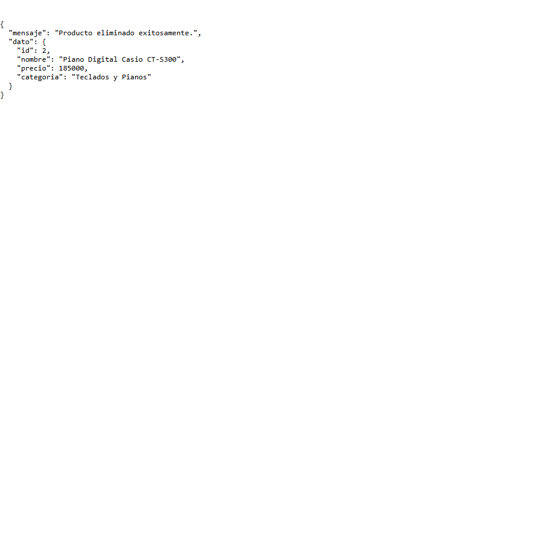

# 🎸 MusicalProductipg — API RESTful con Express.js

API RESTful construida con **Node.js** y **Express.js** para gestionar el catálogo de productos de la tienda de instrumentos musicales **MusicalProductipg**.

---

## 📦 ¿Qué hace esta API?

Permite realizar operaciones **CRUD** (Crear, Leer, Actualizar y Eliminar) sobre un catálogo de productos musicales. Cada producto tiene:

| Campo      | Tipo     | Descripción                          |
|------------|----------|--------------------------------------|
| `id`       | número   | Identificador único (auto asignado)  |
| `nombre`   | string   | Nombre del producto                  |
| `precio`   | número   | Precio en pesos chilenos             |
| `categoria`| string   | Categoría del instrumento            |

---

## 🗂️ Estructura del proyecto

```
MusicalProductipg/
├── index.js       → Servidor principal Express
├── routes.js      → Definición de rutas CRUD
├── data.js        → Array de productos (base de datos en memoria)
├── package.json   → Configuración del proyecto y dependencias
├── .gitignore     → Archivos ignorados por Git
└── README.md      → Documentación del proyecto
```

---

## ⚙️ Instalación y ejecución

### 1. Clonar o descargar el repositorio

```bash
git clone https://github.com/tu-usuario/MusicalProductipg.git
cd MusicalProductipg
```

### 2. Instalar dependencias

```bash
npm install
```

### 3. Ejecutar el servidor

```bash
# Modo producción
npm start

# Modo desarrollo (con auto-reinicio)
npm run dev
```

El servidor quedará corriendo en: **http://localhost:3000**

---

## 🛣️ Rutas disponibles

| Método   | Ruta               | Descripción                        |
|----------|--------------------|------------------------------------|
| `GET`    | `/productos`       | Listar todos los productos         |
| `GET`    | `/productos/:id`   | Obtener un producto por ID         |
| `POST`   | `/productos`       | Crear un nuevo producto            |
| `PUT`    | `/productos/:id`   | Actualizar un producto existente   |
| `DELETE` | `/productos/:id`   | Eliminar un producto               |

---

## 🧪 Ejemplos de pruebas

### 1. GET — Listar todos los productos

**Petición:**
```bash
curl http://localhost:3000/productos
```

**Respuesta JSON:**
```json
{
  "mensaje": "Lista de productos de MusicalProductipg",
  "total": 8,
  "datos": [
    {
      "id": 1,
      "nombre": "Guitarra Electroacústica Yamaha FG800",
      "precio": 320000,
      "categoria": "Guitarras"
    },
    {
      "id": 2,
      "nombre": "Piano Digital Casio CT-S300",
      "precio": 185000,
      "categoria": "Teclados y Pianos"
    }
  ]
}
```

**Pantallazo de la prueba:**



---

### 2. POST — Crear un nuevo producto

**Petición:**
```bash
curl -X POST http://localhost:3000/productos \
  -H "Content-Type: application/json" \
  -d '{"nombre": "Cajón Peruano Pro", "precio": 75000, "categoria": "Percusión"}'
```

**Respuesta JSON (201 Created):**
```json
{
  "mensaje": "Producto creado exitosamente.",
  "dato": {
    "id": 9,
    "nombre": "Cajón Peruano Pro",
    "precio": 75000,
    "categoria": "Percusión"
  }
}
```

**Pantallazo de la prueba:**



---

### 3. PUT — Actualizar un producto existente

**Petición:**
```bash
curl -X PUT http://localhost:3000/productos/1 \
  -H "Content-Type: application/json" \
  -d '{"precio": 299000, "categoria": "Guitarras Acústicas"}'
```

**Respuesta JSON (200 OK):**
```json
{
  "mensaje": "Producto actualizado exitosamente.",
  "dato": {
    "id": 1,
    "nombre": "Guitarra Electroacústica Yamaha FG800",
    "precio": 299000,
    "categoria": "Guitarras Acústicas"
  }
}
```

**Pantallazo de la prueba:**



---

### 4. DELETE — Eliminar un producto

**Petición:**
```bash
curl -X DELETE http://localhost:3000/productos/3
```

**Respuesta JSON (200 OK):**
```json
{
  "mensaje": "Producto eliminado exitosamente.",
  "dato": {
    "id": 3,
    "nombre": "Batería Acústica Pearl Export",
    "precio": 890000,
    "categoria": "Percusión"
  }
}
```

**Pantallazo de la prueba:**



---

## ✅ Códigos HTTP utilizados

| Código | Significado                              |
|--------|------------------------------------------|
| `200`  | Operación exitosa                        |
| `201`  | Recurso creado exitosamente              |
| `400`  | Error de validación (campos inválidos)   |
| `404`  | Recurso no encontrado                    |

---

## 🏗️ Decisiones de diseño

- **Sin base de datos**: Los datos se almacenan en un array en `data.js` para simplificar la implementación. Los cambios se pierden al reiniciar el servidor.
- **IDs automáticos**: Al crear un producto, el `id` se asigna como `array.length + 1`.
- **Validación básica**: Se verifican la presencia y tipo de los campos obligatorios antes de procesar cada petición.
- **Separación de responsabilidades**: `index.js` solo configura el servidor y `routes.js` contiene toda la lógica de rutas.
- **Actualización parcial**: El `PUT` permite enviar solo los campos que se desean modificar, sin necesidad de enviar el objeto completo.

---

## 🛠️ Tecnologías usadas

- [Node.js](https://nodejs.org/)
- [Express.js](https://expressjs.com/)
- [Nodemon](https://nodemon.io/) (desarrollo)
